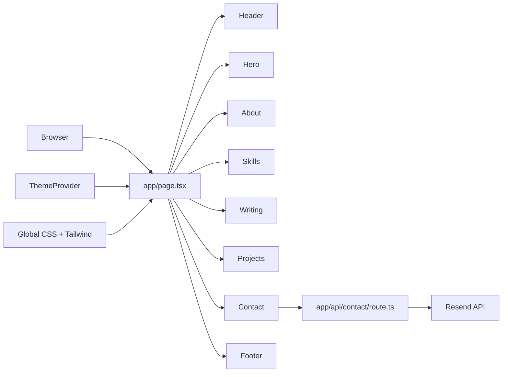

# Portfolio Website

A modern personal portfolio built with Next.js App Router, React, TypeScript, Tailwind CSS, and a reusable UI system patterned after the shadcn/ui approach.

This repository is a single-page personal portfolio designed to present:
- professional background and expertise
- technical skills and capabilities
- featured writing and thought leadership
- selected projects and work highlights
- contact and social links

The codebase is intentionally modular so new engineers or AI agents can understand the page structure quickly and make safe, targeted edits.

## Project Purpose

This application serves as a personal branding and portfolio website. Its main goal is to present the owner’s profile, work history, technical strengths, and contact details in a clean, modern, interactive UI.

The app is designed as a content-first portfolio with composable sections, a reusable design-system layer, and a lightweight server action/API integration for contact submission.

## Tech Stack

- Next.js 16
- React 19
- TypeScript
- Tailwind CSS
- Radix UI primitives
- shadcn/ui-inspired component architecture
- Resend for email delivery
- Vercel Analytics
- next-themes for theme toggling

## High-Level Architecture

The app follows a simple layered structure:

1. App shell layer
   - `app/layout.tsx` defines the root HTML layout, metadata, fonts, global stylesheet import, and analytics provider.
   - `app/page.tsx` composes the homepage by rendering all major portfolio sections in sequence.

2. Presentation layer
   - `components/` contains section components such as `header.tsx`, `hero.tsx`, `about.tsx`, `projects.tsx`, `skills.tsx`, `writing.tsx`, `contact.tsx`, and `footer.tsx`.
   - `components/ui/` contains reusable low-level UI building blocks for cards, buttons, forms, dialogs, navigation, sorting widgets, and other shared interface patterns.
   - `components/theme-provider.tsx` provides the theme context used by the portfolio.

3. Shared utility layer
   - `lib/utils.ts` contains the `cn()` helper used for combining and resolving Tailwind class names.
   - `hooks/` includes reusable hooks for mobile detection and toast notifications.

4. API layer
   - `app/api/contact/route.ts` validates form input and sends the contact message through Resend.

5. Styling and assets
   - `app/globals.css` is the global CSS entry point.
   - `public/` contains static assets such as icons and images.

## Architecture Flow



## Repository Structure

```text
app/
  api/
    contact/
      route.ts
  globals.css
  layout.tsx
  page.tsx
components/
  about.tsx
  contact.tsx
  experience.tsx
  footer.tsx
  header.tsx
  hero.tsx
  projects.tsx
  skills.tsx
  theme-provider.tsx
  writing.tsx
  ui/
hooks/
  use-mobile.ts
  use-toast.ts
lib/
  utils.ts
public/
styles/
  globals.css
```

## Key Files

### `app/page.tsx`
The homepage entry point. It composes the page by rendering each major section in order.

### `app/layout.tsx`
Defines the root layout, metadata, fonts, analytics, and global app shell behavior.

### `components/*.tsx`
These files contain the actual portfolio content and structure. Most content changes will happen here.

### `components/ui/`
The shared component library layer for the site. Reuse these primitives rather than recreating common UI patterns.

### `app/api/contact/route.ts`
The server-side route for the contact form. It validates payloads and sends emails using Resend.

### `lib/utils.ts`
A small utility helper for merging Tailwind class names safely across components.

## Local Development

Install dependencies:

```bash
npm install
```

Start the development server:

```bash
npm run dev
```

Create a production build:

```bash
npm run build
```

Run the production server locally:

```bash
npm run start
```

Run linting:

```bash
npm run lint
```

## Environment Variables

The contact form integration requires the following environment variable:

```bash
RESEND_API_KEY=your_resend_api_key
```

Make sure this variable is present in your local environment or deployment platform before testing the contact submission flow.

## Content Editing Guide

Most content updates should be made in the following files:

- `components/hero.tsx` — headline and introduction
- `components/about.tsx` — bio and background
- `components/skills.tsx` — technical skill set
- `components/writing.tsx` — writing or thought leadership section
- `components/projects.tsx` — project showcase
- `components/contact.tsx` — contact links and form behavior
- `app/layout.tsx` — site metadata and page title
- `app/globals.css` — global styling and shared visual tokens

## Styling Architecture

This app uses Tailwind CSS for layout and component styling. UI structure is defined in component files, while reusable visual primitives are grouped under `components/ui/`.

The design pattern is intentionally simple:
- use Tailwind utility classes directly in components
- prefer the shared UI component primitives for consistency
- avoid introducing new one-off styles unless the system requires it

## Contact Form Flow

The contact experience works as follows:

1. The user submits the form in `components/contact.tsx`
2. The browser sends a `POST` request to `/api/contact`
3. `app/api/contact/route.ts` validates the payload with `zod`
4. The route sends the message through Resend
5. The frontend displays a toast notification for success or failure

## Recommended Working Pattern

When making any feature or content change:

1. Identify the relevant section component in `components/`
2. Reuse existing UI primitives from `components/ui/` if appropriate
3. Keep the styling consistent with the current portfolio design
4. If touching the contact flow, update both the frontend form and the API route together
5. Verify the result using `npm run build` and `npm run lint`

## Notes for Engineers and AI Agents

This is a straightforward Next.js content-driven portfolio application. The most important implementation surfaces are:

- page composition in `app/page.tsx`
- shared layout and metadata in `app/layout.tsx`
- reusable sections in `components/`
- reusable design primitives in `components/ui/`
- server-side contact handling in `app/api/contact/route.ts`

A good rule when contributing:
- keep changes localized
- favor composition over duplication
- reuse shared UI primitives
- preserve the existing layout and visual tone

## Suggested Future Improvements

- move portfolio content into a structured configuration file or CMS
- add unit or integration tests for contact form behavior
- add smoke tests for key page sections
- document deployment steps for Vercel or another hosting provider
- introduce a central data model for projects, writing, and experience items
